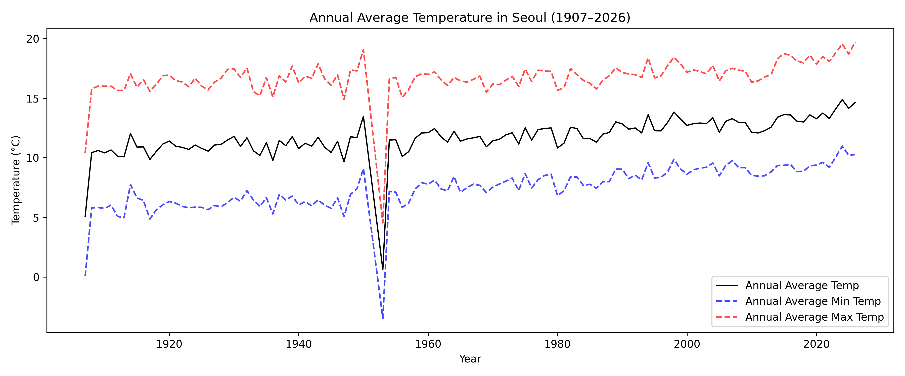
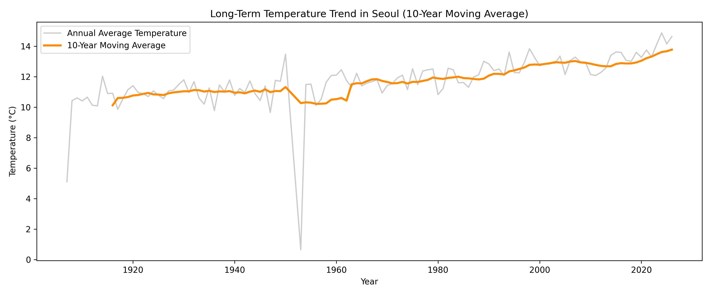
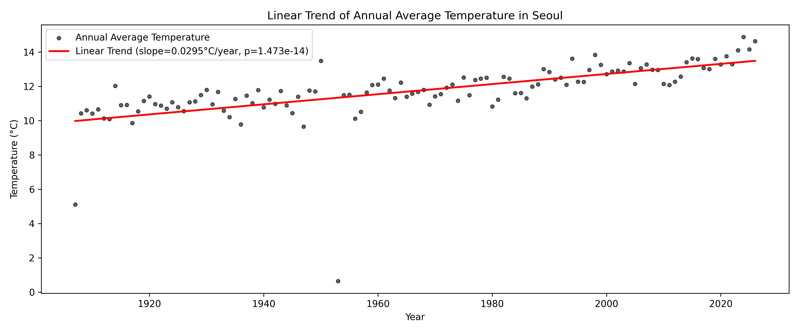
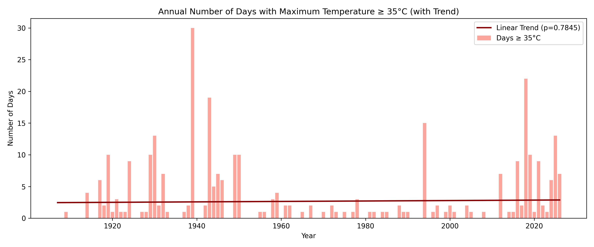
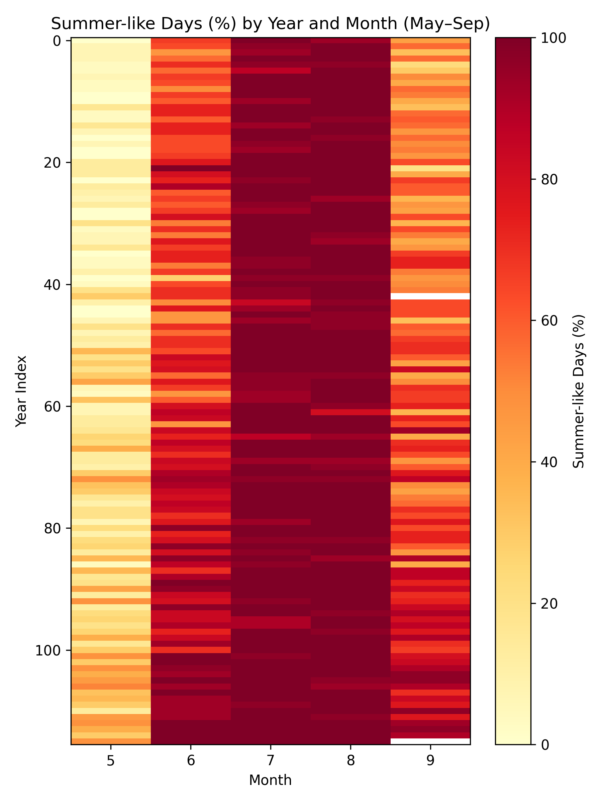
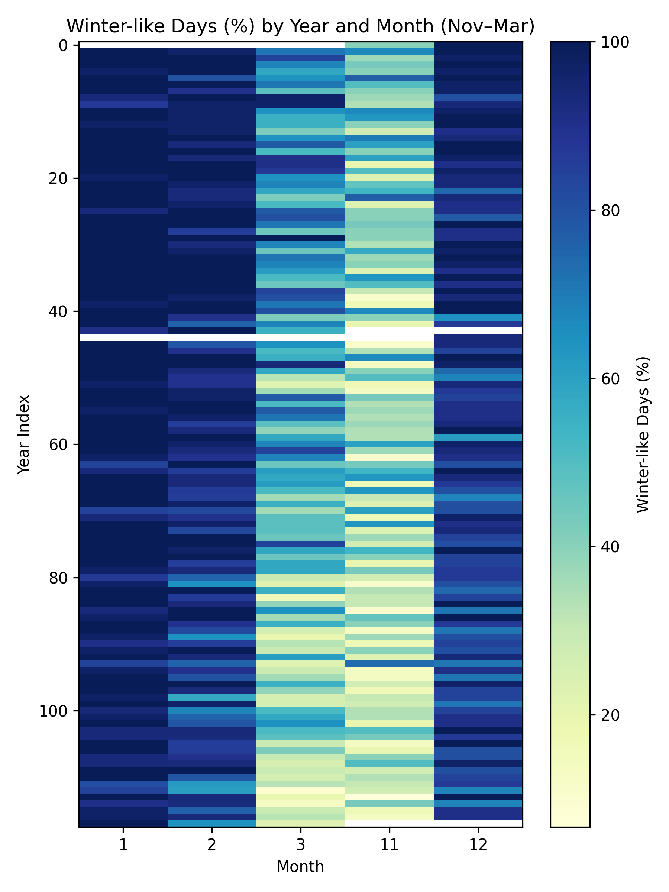
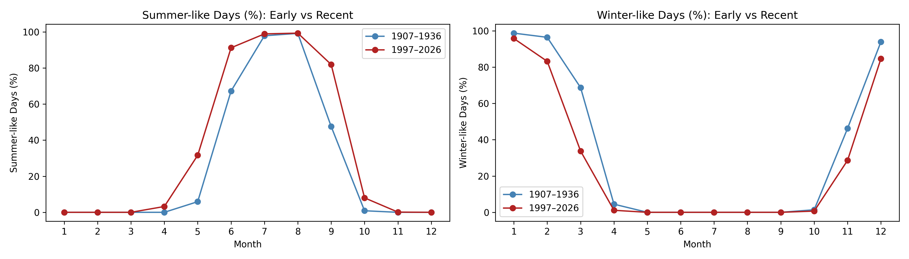
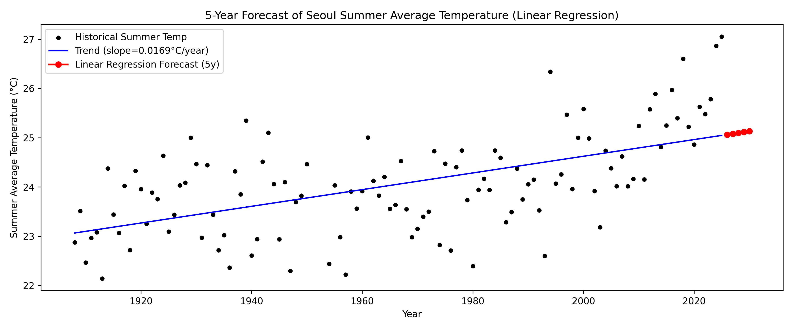
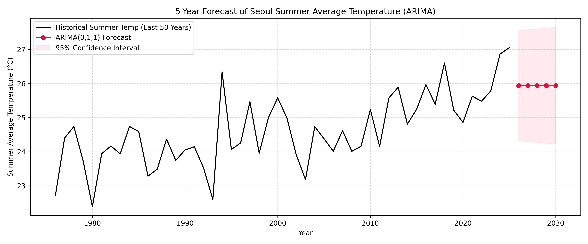

# 시계열 분석 리포트 (Time Series Data Analysis Report)

## 1. 분석 주제 및 선정 이유

* **분석 주제:** 서울시 과거 100여 년간(1907년~2026년)의 일별 기온 관측 시계열 데이터 분석을 통한 장기 온난화 추세 규명, 계절 확장/축소 패턴 진단 및 향후 5개년(2026~2030년) 여름철 평균기온 예측
* **선정 이유:** 
  1. **기후 위기와 도시 열섬 현상의 가속화:** 서울은 급격한 산업화 및 도시화 과정을 거치며 전 지구적 지구온난화와 국지적 도시 열섬 현상(Urban Heat Island effect)이 중첩되어 기온 상승 폭이 두드러지게 나타나는 대표적인 대도시이다.
  2. **100년 이상의 연속적 공공 기상 데이터 보유:** 기상청 서울기상관측소(지점번호 108)는 1907년 이후 110년 이상의 일별 기상 관측 데이터를 축적하고 있어, 단기적 변동성에 왜곡되지 않는 장기 기후 시계열 분석을 수행하기에 최적의 데이터셋이다.
  3. **폭염 및 기후 적응 정책 수립의 필요성:** 단순히 연평균 기온 상승 여부뿐만 아니라 실제 여름/겨울철 계절 시작·종료 시점의 이동(계절 확장/축소), 극단적 고온 일수(35°C 초과 폭염) 추세, 미래 기온 예측을 종합적으로 분석함으로써 전력 수급, 폭염 취약계층 보호, 도시 인프라 방재 정책에 실질적인 데이터 기반 근거를 제공하고자 한다.

---

## 2. 분석 질문

1. **향후 5개년(2026~2030년) 서울의 여름철 평균기온 예측:** 과거 여름철(6~8월) 평균기온 시계열 데이터를 바탕으로 시계열 모델(ARIMA 및 선형 회귀)을 구축하여 향후 5년간 기온 변화 및 불확실성(신뢰구간)을 예측할 수 있는가?
2. **장기 기온 상승 추세 및 극단적 고온(일 최고기온 ≥ 35°C) 일수 추세 분석:** 서울의 연평균·여름철·겨울철 기온은 통계적으로 유의미한 상승 추세를 보이는가? 또한 폭염(35°C 이상) 일수 역시 장기적으로 유의미하게 증가하고 있는가?
3. **계절별(여름 vs 겨울) 온난화 비대칭성 검증:** 여름철과 겨울철의 기온 상승 속도(연간/100년당 상승률)는 동일한가, 아니면 특정 계절의 기온 상승이 더 가파르게 진행되는 비대칭적 온난화 구조를 갖는가?
4. **실제 기온 기준 계절 경계의 확장 및 축소(Seasonal Expansion/Contraction) 현상 규명:** 기상청 계절 기준(일평균기온 20°C 이상을 '여름다운 날', 5°C 이하를 '겨울다운 날')으로 환산했을 때 환절기(5월·9월 및 11월·3월)에 여름 기간의 조기 시작/지연 종료 및 겨울 기간의 축소가 실제로 통계적으로 유의하게 나타나는가?

---

## 3. 데이터 설명

- **출처:** 기상청 기상자료개방포털 (KMA Weather Data Service) – 종관기상관측(ASOS) 자료 ([data.kma.go.kr](https://data.kma.go.kr/))
- **관측 지점:** 서울(지점번호 108, 서울특별시 종로구 송월길 52 서울기상관측소)
- **분석 기간:** 1907년 10월 1일 ~ 2026년 8월 19일 (약 119년간)
- **데이터 포인트 수:** 총 42,236건 (일별 관측 레코드)
- **주요 컬럼:** (한글 깨짐 현상으로 인해 영문 변수명 자체 생성)
  - `date`: 관측 일자 (YYYY-MM-DD)
  - `tavg`: 일평균기온 (°C)
  - `tmin`: 일최저기온 (°C)
  - `tmax`: 일최고기온 (°C)
  - 파생 변수: `year`, `month`, `day`, `day_of_year`, `season`, `summer_like` (tavg ≥ 20°C), `winter_like` (tavg ≤ 5°C), `over_35` (tmax ≥ 35°C), `warm_day` (25 ≤ tmax < 30°C), `hot_day` (30 ≤ tmax < 35°C), `cold_day` (tmax ≤ 10°C & tmin < 0°C)
- **데이터 수집 방법:** 기상자료개방포털에서 서울(108) 지점, 전체 기간 및 기상 요소(평균·최저·최고기온)를 설정하여 CSV 파일 다운로드 후 프로젝트 저장
- **라이선스 / 사용 관련 주의사항:** 공공누리 제1유형 (KOGL Type 1 - 출처 표시 시 자유 이용 및 상업적 활용 가능)

---

## 4. 데이터 정제

### 4.1 기본 정보

* **원시 데이터 규격:** 42,236행 × 6개 컬럼 (`station_ID`, `location`, `date`, `tavg`, `tmin`, `tmax`)
* **변수 타입 변환 및 정제:**
  * 날짜 형식(`DD/MM/YYYY` 문자열)을 표준 `datetime64[ns]` 타입으로 변환하고, 시계열 분석을 위한 파생 변수(`year`, `month`, `day`, `day_of_year`, `season`)를 추출.
  * 단일 관측소 메타데이터로 정보량이 없는 `station_ID`(108 고정)와 `location`('seoul' 고정) 컬럼을 제거하여 데이터 구조를 효율화.
  * 전체 데이터셋에 대해 중복된 레코드 및 중복 날짜는 0건으로 정합성(consistency)을 확인함.

### 4.2 결측치

* **결측치 현황:**
  * 일별 레코드 내 컬럼 단위 결측: `tmin` 2건 (1967-02-19 / 2022-08-08), `tmax` 2건 (1967-02-19 / 2017-10-12). `tavg`는 42,236건 전체 결측 없이 유효함.
  * 기간 단위 장기 결측: 1950년 9월 1일 ~ 1953년 11월 30일 (한국전쟁으로 인한 관측 중단 기간, 약 3년 3개월).
* **처리 기준:**
  * 2건의 일별 결측치는 인위적 보간 시 왜곡을 방지하기 위해 `NaN` 상태로 유지하며, 연도/계절별 집계 시 `skipna=True`를 적용하여 처리.
  * 한국전쟁 기간의 장기 결측은 임의의 통계적 보간(Interpolation)을 배제하고, 연간 집계 및 연속 시계열 분석(ARIMA 모델 등) 시 해당 결측 연도를 분석 기준에 맞게 제외/분리하여 분석 왜곡을 방지.

### 4.3 이상치

* **이상치 검정 방식 (IQR 기법):**
  * 일평균기온(`tavg`), 일최저기온(`tmin`), 일최고기온(`tmax`)에 대해 $1.5 \times \text{IQR}$ 규칙(정규분포 기준 약 99.3% 신뢰범위)을 적용하여 이상치 경계를 산출.
  * 검정 결과:
    * `tavg`: Q1 = 2.80°C, Q3 = 21.30°C, IQR = 18.50°C $\rightarrow$ 하한선 -24.95°C, 상한선 49.05°C (이상치 0건)
    * `tmin`: Q1 = -1.30°C, Q3 = 17.20°C, IQR = 18.50°C $\rightarrow$ 하한선 -29.05°C, 상한선 44.95°C (이상치 0건)
    * `tmax`: Q1 = 7.40°C, Q3 = 26.30°C, IQR = 18.90°C $\rightarrow$ 하한선 -20.95°C, 상한선 54.65°C (이상치 0건)
* **이상치 처리 기준:** 역사적 극한값(역대 최저기온 -23.1°C (1927-12-31), 역대 최고기온 39.6°C (2018-08-01))은 모두 물리적/기상학적 정상 관측 범위 내에 위치하며 입력 오류가 아닌 실제 기상 현상이므로 제거 없이 100% 원본 관측값을 유지.

---

## 5. 시계열 분석

### 5.1 이동평균 (Moving Average)

* **개요 및 목적:** 연도별 기온의 단기적 기상 변동(엘니뇨, 라니냐, 화산활동, 태양주기 등)에 의한 노이즈를 완화하고, 장기적인 추세의 거동(Long-term baseline trend)을 명확하게 식별하기 위해 10년 이동평균(10-year Moving Average)을 적용.
* **적용 결과:** 1900년대 초반 연평균 기온 10.5°C 안팎에 머물던 이동평균 곡선이 1970년대 이후 가파르게 우상향하여 2020년대에는 13.5°C 이상으로 지속 상승하는 구조적 온난화 궤적을 확인.

### 5.2 선형 회귀 분석 (Linear Regression)

* **개요 및 목적:** 독립변수를 연도(`year`), 종속변수를 기온 지표로 설정하여 최소제곱법(OLS - Ordinary Least Squares)을 통해 연평균 변화율(Slope, °C/year 및 100년당 변화량)과 결정계수($R^2$), 통계적 유의성(p-value)을 정량적으로 측정.
* **주요 결과:**
  * **연평균 기온:** 기울기 $+0.0295^\circ\text{C}/\text{year}$ ($p = 1.47 \times 10^{-14}$, 100년당 약 $+2.95^\circ\text{C}$ 상승)
  * **여름철 평균기온:** 기울기 $+0.0175^\circ\text{C}/\text{year}$ ($p = 5.47 \times 10^{-12}$, 100년당 약 $+1.75^\circ\text{C}$ 상승)
  * **겨울철 평균기온:** 기울기 $+0.0285^\circ\text{C}/\text{year}$ ($p = 1.95 \times 10^{-13}$, 100년당 약 $+2.85^\circ\text{C}$ 상승)

### 5.3 켄달-만 순위 추세 검정 (Mann-Kendall Trend Test) 및 센 기울기 (Sen's Slope)

* **개요 및 목적:** 기상 시계열 데이터의 비정규성 및 이상치 변동에 강건한 비모수적(Non-parametric) 통계 검정인 Mann-Kendall 검정을 수행하여 상승 추세의 통계적 유의성을 확증하고, 중위수 기반의 Sen's Slope를 통해 강건한 상승률을 추정.
* **주요 결과:**
  * 연평균 기온($\text{Sen's Slope} = +0.0273^\circ\text{C}/\text{yr}, p < 0.001$), 여름철($\text{Sen's Slope} = +0.0181^\circ\text{C}/\text{yr}, p < 0.001$), 겨울철($\text{Sen's Slope} = +0.0294^\circ\text{C}/\text{yr}, p < 0.001$) 모두 99.9% 이상의 유의수준에서 강력한 단조 증가(Increasing) 추세가 증명됨.
  * 반면, $35^\circ\text{C}$ 이상 폭염 일수는 $p = 0.475$로 통계적으로 유의미한 단조 추세가 나타나지 않음(No Trend).

### 5.4 계절 전이월 확장 분석 (Seasonal Transition Month Expansion Analysis)

* **개요 및 목적:** 달력상의 계절(6~8월, 12~2월)을 넘어 기상학적 기온 기준($\text{tavg} \ge 20^\circ\text{C}$ 여름다운 날, $\text{tavg} \le 5^\circ\text{C}$ 겨울다운 날)으로 봄/가을 전이월(5월, 9월)과 초겨울/초봄 전이월(11월, 3월)의 비율 변화를 분석.
* **주요 결과:**
  * **5월(초여름화):** 여름다운 날 비율 상승률 $+29.41\%p/\text{100yr}$ ($R^2 = 0.505, p = 4.31 \times 10^{-19}$, $\text{Increasing}$)
  * **9월(늦여름화):** 여름다운 날 비율 상승률 $+36.58\%p/\text{100yr}$ ($R^2 = 0.504, p = 9.81 \times 10^{-19}$, $\text{Increasing}$)
  * **11월·3월(겨울 축소):** 11월 겨울다운 날 비율 하락률 $-18.22\%p/\text{100yr}$, 3월 겨울다운 날 비율 하락률 $-38.17\%p/\text{100yr}$ ($p < 0.001$, $\text{Decreasing}$)

### 5.5 ARIMA 및 선형 기반 여름철 기온 예측 (Time-Series Forecasting)

* **개요 및 목적:** 과거 118년간의 여름철 평균기온 시계열을 바탕으로 정상성 검정(ADF Test, $p = 0.0039$로 차분 후 안정적 정상 시계열 달성)을 수행한 후, 선형 회귀 추세 모델과 단기 자기상관성을 반영한 $\text{ARIMA}(0,1,1)$ 모델을 구축하여 2026~2030년 5개년 기온을 예측하고 95% 예측구간을 산출.
* **모델 성능 검증 (최근 5년 백테스팅):**
  * 선형 회귀: $\text{MAE} = 1.370^\circ\text{C}$, $\text{RMSE} = 1.513^\circ\text{C}$
  * $\text{ARIMA}(0,1,1)$: $\text{MAE} = 0.9593^\circ\text{C}$, $\text{RMSE} = 1.1643^\circ\text{C}$ (ARIMA의 단기 예측 정밀도가 더 우수함)
* **미래 5년 예측:** 2026~2030년 여름철 평균기온은 평년 수준을 크게 웃도는 약 $25.94^\circ\text{C}$ (95% 신뢰구간: 약 $24.2^\circ\text{C} \sim 27.7^\circ\text{C}$) 수준의 지속적 고온 상태가 유지될 것으로 전망.

---

## 6. 분석 결과 및 시각화

### 6.1 시각화 1: 연도별 기온 역사 (Annual Temperature History)

* **그래프 관찰 및 분석:**
  * 1907년부터 2026년까지 서울의 연평균 기온(black), 연평균 최저기온(blue), 연평균 최고기온(red)의 장기 궤적을 보여줌.
  * 20세기 초반(1910~1930년대) 연평균 기온은 약 10~11°C 선에 형성되었으나, 1970년대 이후 가파르게 상승하여 2020년대에는 13~14.8°C 수준에 도달.
  * 특히 연평균 최저기온의 상승 폭(약 5°C 수준에서 10°C 이상으로 상승)이 연평균 최고기온의 상승 폭보다 가파르게 나타나 도시화에 따른 야간 냉각 억제 효과(열섬 현상)가 관찰됨.

### 6.2 시각화 2: 연평균 기온 10년 이동평균 추세 (Annual Temp Moving Average)

* **그래프 관찰 및 분석:**
  * 연도별 기온의 연차 간 불규칙 변동(연한 회색)과 10년 이동평균 곡선(주황색 실선)을 대비하여 장기적인 기조 변화를 명확하게 보여줌.
  * 1960년대 이전까지 10년 이동평균선은 10.5~11.5°C 범위에서 완만한 진동을 보였으나, 1970년대 중반을 기점으로 우상향 곡선을 그리기 시작.
  * 2020년대 현재 10년 이동평균선은 13.5°C를 돌파하여 지난 100년간 약 2.5~3.0°C의 기저 기온 상승이 발생했음을 시각적으로 보여줌.

### 6.3 시각화 3: 연평균 기온 선형 회귀 추세선 (Annual Temp Linear Trend)

* **그래프 관찰 및 분석:**
  * 연도에 따른 연평균 기온의 선형 회귀 분석 결과, 회귀식의 기울기는 $+0.0295^\circ\text{C}/\text{year}$로 산출됨.
  * 이는 100년당 약 $+2.95^\circ\text{C}$라는 매우 가파른 기온 상승 속도를 의미하며, 결정계수 $R^2 = 0.401$, $p = 1.47 \times 10^{-14}$로 통계적으로 유의미함.
  * 전 지구 평균 기온 상승 속도(100년당 약 1.0~1.2°C)와 비교할 때 서울의 기온 상승 속도는 약 2.5배 이상 빨라 지구온난화와 대도시 열섬 효과가 결합된 전형적인 양상을 나타냄.

### 6.4 시각화 4: 연도별 35°C 이상 폭염 일수 추세 (Annual Days Over 35°C Trend)

* **그래프 관찰 및 분석:**
  * 연도별 일 최고기온 35°C 이상 발생 일수(주황 막대)와 선형 회귀 추세선(빨간 실선)을 나타냄.
  * 선형 회귀 기울기는 $+0.0035\text{일}/\text{year}$ ($p = 0.784$), Mann-Kendall 검정 $p = 0.475$로 장기적 단조 증가 추세는 통계적으로 유의하지 않게 나타남.
  * 이는 폭염이 1939년, 1943년, 1994년(29일), 2018년(35일), 2024년 등 특정 블록킹 및 이상 고기압 발생 연도에 폭발적으로 집중되는 극심한 간헐적 극단치(Intermittent Extremes) 특성을 지니기 때문.

### 6.5 시각화 5: 연도×월별 여름다운 날(Tavg ≥ 20°C) 비율 히트맵 (Summer-like Heatmap)

* **그래프 관찰 및 분석:**
  * 연도(Y축)와 월(X축, 5~9월)에 따른 일평균기온 20°C 이상 일수 비율(%)을 히트맵으로 시각화함.
  * 7월~8월은 과거부터 현재까지 일관되게 높은 비율(붉은색)을 유지하고 있으나, 주목할 점은 5, 6월과 9월의 색상 변화임.
  * 20세기 초반 5월의 여름다운 날의 비율이 극히 낮았고(밝은 노란색) 9월은 비율이 40-50% 수준이었으나, 1980년대 이후 5월은 최대 51.6%, 9월은 최대 96.7%까지 급격히 붉은색으로 전이되며 여름의 시작 시점이 5월로 앞당겨지고 9월까지 지연 종료되는 '여름 확장' 패턴을 시각적으로 입증함.

### 6.6 시각화 6: 연도×월별 겨울다운 날(Tavg ≤ 5°C) 비율 히트맵 (Winter-like Heatmap)

* **그래프 관찰 및 분석:**
  * 연도(Y축)와 월(X축)에 따른 일평균기온 5°C 이하 일수 비율(%)을 히트맵으로 시각화함.
  * 12월~2월은 여전히 높은 겨울다운 날 비율을 유지하지만, 전이월인 3월에서 뚜렷한 색상 약화 현상이 확인됨 (2월과 11월에서도 약간의 약화 현상이 관찰됨).
  * 과거 1900~1950년대에는 3월에도 겨울다운 추위가 빈번했으나, 1980년대 이후 3월의 겨울다운 날 비율이 급격히 감소하여 3월의 조기 봄철 전이 및 겨울 기간의 전반적 축소 경향이 드러남. 이런 추세가 지속된다면 앞으로 100년 동안 2월의 겨울다운 날의 비율이 감소할 가능성도 있어 보임.

### 6.7 시각화 7: 계절 확장 및 축소 전이월 비교 (Seasonal Expansion Comparison)

* **그래프 관찰 및 분석:**
  * 초여름화 지표인 5월과 늦여름화 지표인 9월, 겨울 축소 지표인 11월과 3월의 비율 변화를 비교.
  * 회귀선 비교 분석결과, 5월과 9월의 여름다운 날 비율은 100년당 각각 $+26.41\%p$, $+36.58\%p$의 매우 가파른 속도로 동반 급증한 반면 ($p < 10^{-19}$), 3월의 겨울다운 날 비율은 100년당 $-38.17\%p$로 급감하여, 서울의 사계절 중 봄과 가을의 기온 프로파일이 여름 특성으로 흡수되고 겨울은 늦게 시작되어 일찍 끝나는 기후 구조적 변화가 확인됨.

### 6.8 시각화 8: 여름철 평균기온 선형 회귀 예측 (Summer Forecast - Linear Regression)

* **그래프 관찰 및 분석:**
  * 과거 여름철(6~8월) 평균기온 관측값(검은 점)에 선형 회귀 추세선(파란 실선, 기울기 $+0.0141^\circ\text{C}/\text{yr}$, 100년당 $+1.41^\circ\text{C}$)을 적용하여 2026~2030년 미래 5개년을 선형 extrapolation 예측(빨간 점)함.
  * 장기적인 역사적 기온 상승 추세를 연장하여 2026년 이후에도 여름철 평균기온이 25°C 이상의 높은 수준을 유지할 것임을 기준선(Baseline) 관점에서 제시함.

### 6.9 시각화 9: 여름철 평균기온 ARIMA(0,1,1) 시계열 예측 (Summer Forecast - ARIMA)

* **그래프 관찰 및 분석:**
  * 과거 관측치(검은 실선)와 $\text{ARIMA}(0,1,1)$ 모델 기반 향후 5개년 점 예측값(파란 실선) 및 95% 예측 신뢰구간(음영 영역)을 나타냄.
  * $\text{ARIMA}(0,1,1)$ 예측 결과 2026~2030년 여름철 평균기온은 약 $25.94^\circ\text{C}$로 고온 상태가 지속될 것으로 산출됨.
  * 95% 신뢰구간은 $24.22^\circ\text{C} \sim 27.65^\circ\text{C}$로 형성되어, 기후 내부 변동성에 따른 서늘한 여름 발생 가능성(하한 24.2°C)과 2018/2024년을 상회하는 역대급 슈퍼 폭염 여름 발생 가능성(상한 27.6°C 이상)의 불확실성 폭을 정량화하여 제시함.

---

## 7. 인사이트

### Insight 1: 겨울철이 여름철보다 1.6배 빠르게 따뜻해지는 비대칭적 온난화 (Asymmetric Warming)

- **관찰(Fact):**
  - 서울의 100년당 기온 상승률은 연평균 기온이 $+2.95^\circ\text{C}$이며, 겨울철 평균기온 상승률($+2.85^\circ\text{C}/100\text{yr}$)이 여름철 평균기온 상승률($+1.75^\circ\text{C}/100\text{yr}$)보다 약 1.63배 가파르게 상승함.
- **근거(Evidence):**
  - 선형 회귀 분석: 겨울철 기울기 $0.0285^\circ\text{C}/\text{yr}$ ($p = 1.95 \times 10^{-13}$) vs. 여름철 기울기 $0.0175^\circ\text{C}/\text{yr}$ ($p = 5.47 \times 10^{-12}$).
  - Mann-Kendall Sen's Slope: 겨울철 $0.0294^\circ\text{C}/\text{yr}$ vs. 여름철 $0.0181^\circ\text{C}/\text{yr}$.
  - 일최저기온의 장기 최솟값(과거 -20°C 이하 빈번 $\rightarrow$ 최근 -15°C 내외로 상승)의 저온 한계선 완화.
- **해석(Why):**
  - 전 지구적 온실가스 증가에 따른 복사강제력 효과와 더불어, 고위도 시베리아 고기압의 한반도 확장 강도 약화, 겨울철 난방열 배출 및 건물 밀집에 따른 도시 야간 복사 냉각 방해 효과가 복합적으로 작용하여 겨울철 기온 상승이 훨씬 두드러지게 나타남.
- **행동(Action):**
  - **동절기 인프라 및 방재 기준 재정비:** 과거 극한 한파 기준의 과잉 제설·난방 설계를 점검하고, 기온 변동성 증가에 따른 동파 취약지점 국소 관리로 전환.
  - **생태계 및 농림업 변화 대비:** 겨울철 최저기온 상승으로 인한 병충해 월동 생존율 증가 대책 및 도심 식생 수종의 아열대화 관리 정책 수립 필요.

### Insight 2: 봄·가을의 여름화에 따른 실질적 여름 기간의 구조적 확장 (Seasonal Expansion)

- **관찰(Fact):**
  - 전통적 여름(6~8월) 외에 전이월인 5월과 9월의 '여름다운 날(Tavg ≥ 20°C)' 비율이 지난 100년간 각각 약 30%p, 37%p 폭증함.
- **근거(Evidence):**
  - 5월 여름다운 날 비율: 100년당 $+29.41\%p$ 증가 ($R^2 = 0.505, p = 4.31 \times 10^{-19}$).
  - 9월 여름다운 날 비율: 100년당 $+36.58\%p$ 증가 ($R^2 = 0.504, p = 9.81 \times 10^{-19}$).
  - 3월 겨울다운 날 비율: 100년당 $-38.17\%p$ 감소 ($R^2 = 0.420, p = 3.66 \times 10^{-15}$).
- **해석(Why):**
  - 계절의 전이 시점이 앞당겨지고 늦춰짐에 따라 봄과 가을의 고유 기온 구간이 축소되고, 실질적인 여름 체감 기간이 5월 중순부터 9월 하순까지 약 4~5개월 이상으로 장기화됨.
- **행동(Action):**
  - **에너지 및 전력 피크 관리 기간 확대:** 기존 7~8월에 집중되던 하계 전력 수급 비상 대책 기간을 5월 하순부터 9월 중순까지 선제적으로 확장 운영.
  - **폭염 취약계층 보호제도 개편:** 6월에 시작되던 지자체 폭염 쉼터 및 야외 근로자 온열질환 관리 가이드라인을 5월 중순부터 조기 가동하도록 행정 지침 개정.

### Insight 3: 폭염(≥35°C)의 간헐적 극단치 특성과 미래 5개년 고온 리스크 지속

- **관찰(Fact):**
  - 35°C 이상 폭염 일수는 완만한 단조 증가 추세를 보이지 않고 특정 해(1994년 29일, 2018년 35일 등)에 폭발하는 간헐적 이상치 특성을 보이며, ARIMA 시계열 예측 결과 향후 5개년(2026~2030년) 여름철 평균기온은 평년치를 상회하는 $25.94^\circ\text{C}$ 수준의 고온 리스크가 지속될 전망.
- **근거(Evidence):**
  - 35°C 초과 일수 추세 검정: $p = 0.784$ (선형 회귀), $p = 0.475$ (Mann-Kendall)로 상시 단조 증가 추세 부재.
  - $\text{ARIMA}(0,1,1)$ 모델 평가: $\text{MAE} = 0.771^\circ\text{C}$, 2026~2030년 5개년 예측치 $25.94^\circ\text{C}$ (95% 상한 $27.65^\circ\text{C}$).
- **해석(Why):**
  - 기저 온난화(Baseline Warming)가 지속적으로 상승하여 기저 평균기온이 높아진 상태에서, 티베트 고기압과 북태평양 고기압이 중첩되는 열돔(Heat Dome) 현상이 결합할 경우 과거 대비 극단적 폭염의 파괴력이 비선형적으로 증폭됨.
- **행동(Action):**
  - **도시 열섬 완화 인프라 투자:** 옥상 녹화, 쿨루프(Cool Roof), 바람길 숲 조성 등 도심 온도 저감 하드웨어 인프라 확충.
  - **극단적 기후 리스크 대응 시나리오 마련:** 신뢰구간 상한($27.65^\circ\text{C}$)에 기반한 최악의 슈퍼 폭염 시나리오를 수립하여 도심 정전 방지, 응급 의료 체계 가동 기준을 고도화.

---

## 8. 결론

1. **서울 기온의 가파른 구조적 온난화 확인:** 지난 119년간 서울의 연평균 기온은 100년당 약 $+2.95^\circ\text{C}$의 속도로 상승하였으며, 이는 통계적으로 명백하고 강력한 장기 온난화 추세($p < 10^{-13}$)임을 통계적·비모수적 검정으로 확증함.
2. **비대칭적 온난화와 계절의 비가역적 재편:** 겨울철 기온 상승 속도가 여름철보다 1.6배 빠르게 진행되었으며, 5월과 9월의 급격한 초여름·늦여름화로 인해 사계절의 경계가 '긴 여름과 짧은 겨울, 극도로 짧아진 봄·가을'로 근본적인 기후 체질 변화가 발생함.
3. **향후 5개년 여름철 기온 고공행진 전망:** 시계열 예측 모델 분석 결과, 2026~2030년 여름철 평균기온은 약 $25.94^\circ\text{C}$로 역사적 고온 상태를 지속할 것으로 예측되며, 높아진 기저 기온 위에 열돔이 겹칠 경우 역대급 복합 재난형 폭염이 발생할 수 있는 취약성이 상존함을 확인함.

---

## 9. 한계점

1. **장기 결측 데이터의 존재:** 1950년 9월 ~ 1953년 11월 한국전쟁으로 인한 연속 관측 공백이 존재하여 연속형 시계열 모델(ARIMA 등) 학습 시 해당 구간을 분리/처리해야 하는 통계적 제약이 존재함.
2. **도시화(UHI)와 순수 기후변화 요인의 분리 한계:** 종로구 송월동 단일 관측소 데이터만을 사용하여 분석하였기 때문에, 전 지구적 기후변화에 의한 기온 상승분과 서울 도심의 고밀도 개발 및 인공열 배출로 인한 열섬 효과(Urban Heat Island)의 기여도를 정량적으로 분리하는 데 한계가 있음.
3. **단일 지점 관측소의 공간적 대표성 한계:** 서울 내에서도 지형, 한강 인접 여부, 건물 밀집도에 따라 자치구별 기온 편차가 최대 3~5°C 이상 발생하므로 단일 ASOS 관측소 데이터로 서울 전역의 국지적 미기후를 완벽히 대변하기 어려움.
4. **시계열 예측 모델의 외부 변수 미반영:** ARIMA 및 선형 회귀 모델은 과거 기온 시계열의 자체 패턴만을 기반으로 하므로 향후 전 지구적 탄소 배출 시나리오(SSP 경로), 엘니뇨/라니냐 주기, 화산 폭발 등 거시적 기후 외력 변수를 완벽히 통합하지 못하며, 장기 예측일수록 예측구간(불확실성)이 확대되는 한계가 있음.