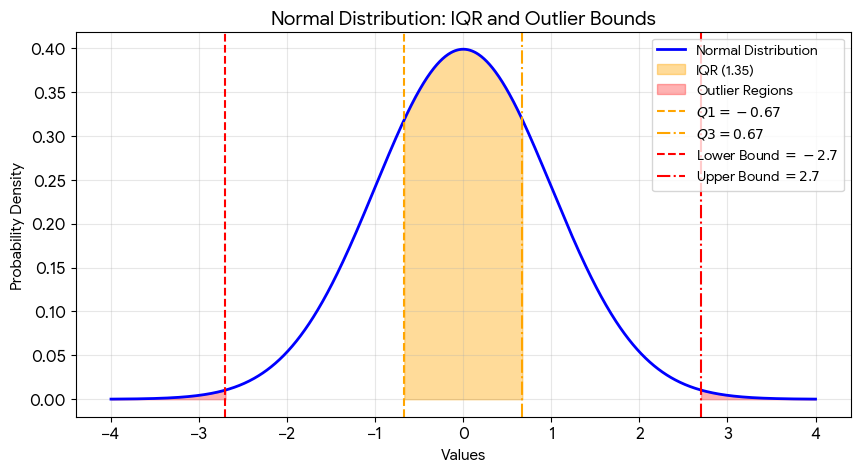

We use 1.5 because it is a statistical standard established by statistician John Tukey to balance finding true outliers without accidentally labeling normal data variation as extreme.

## The Logic Behind 1.5

* The Normal Distribution Fit: In a perfectly normal, bell-shaped distribution, the Interquartile Range (IQR) covers the middle 50% of the data.
* The 99.3% Coverage: Extending the boundaries by $1.5 \times \text{IQR}$ below $Q_1$ and above $Q_3$ creates a window that captures roughly 99.3% of all data points.
* The 0.7% Outliers: Only about 0.7% of normal data points will fall outside these boundaries. This makes it a highly effective "sweet spot" for flagging genuinely unusual data.

## Visualizing the Outlier Boundaries
The visualization below shows how the $1.5 \times \text{IQR}$ rule sets boundaries on a standard normal distribution. Data points falling outside the red dashed lines are flagged as outliers.

## Can You Change the 1.5?
Yes, you can adjust this multiplier based on how strict you want to be:

* Use 3.0 for "Extreme" Outliers: If you change 1.5 to 3.0, you will only catch extreme values. This boundary covers 99.998% of normal data.
* Use Lower (e.g., 1.0) for Strict Filtering: If your data is highly uniform and you want to flag minor variations, lowering the number makes the filter more aggressive.

Would you like to see how to write code to remove these outliers from your DataFrame once you have found them?

