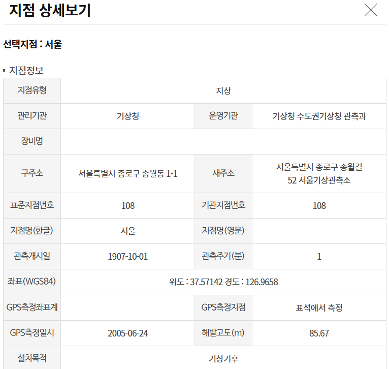
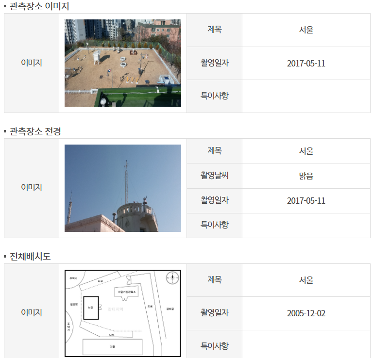
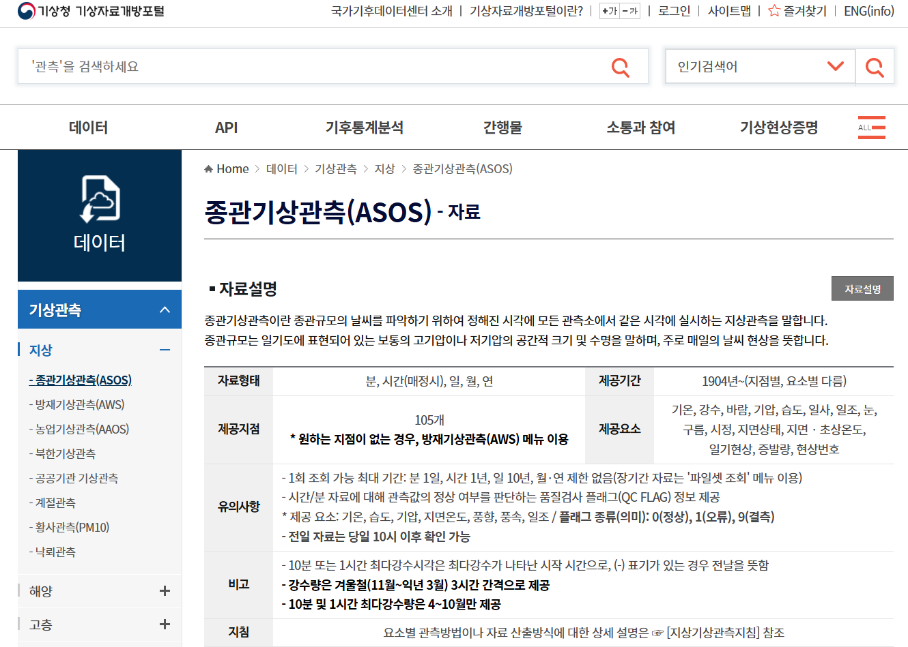
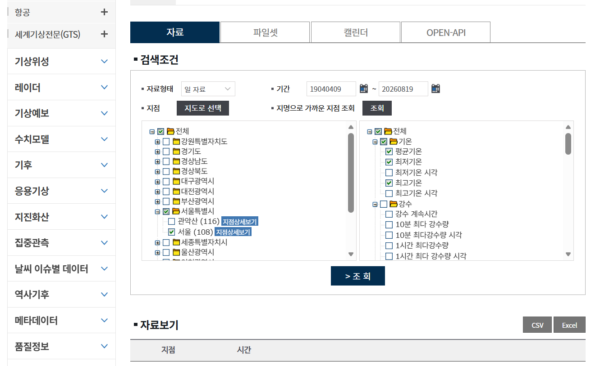

# 데이터 (Data)

## 1. 원본 데이터 (Raw Data)

원본 데이터셋은 `data/raw/` 폴더에 저장되어 있다.

* **원본 파일:** `data/raw/dataset_original.csv`
* **출처:** [기상청 기상자료개방포털 – 종관기상관측(ASOS) 자료](https://data.kma.go.kr/data/grnd/selectAsosRltmList.do?pgmNo=36)
* **URL:** [data.kma.go.kr](https://data.kma.go.kr/)
* **데이터 다운로드/수집일:** 2026-08-20
* **데이터 기간:** 1907-10-01 ~ 2026-08-19
    - 단, 한국전쟁으로 인해 1950-09-01 ~ 1953-11-30 기간의 데이터는 결측되어 있음.
* **관측 지점:** 서울(108)
* **관측 지점 주소:** 서울특별시 종로구 송월길 52 서울기상관측소
    - Seoul Weather Station, 52 Songwol-gil, Jongno-gu, Seoul, Republic of Korea
* **라이센스:** 공공누리 제1유형(KOGL Type 1) - 출처 표시 후 무료 이용 및 상업적 이용 가능
* **데이터명:** 종관기상관측(ASOS) 자료 (ASOS KMA Dataset)
* **데이터 다운로드/수집 방법:** 기상자료개방포털에서 관측 지점(서울), 조회 기간 및 기상 요소(평균기온, 최저기온, 최고기온)를 선택한 후 CSV/Excel 형식으로 다운로드
* **주요 변수:** 지점, 날짜/시간, 평균기온, 최저기온, 최고기온

> **KMA:** Korea Meteorological Administration (기상청)

---

[관측 지점 상세]

 

  <table>
    <tr>
      <td align="center">
        
      </td>
      <td align="center">
        
      </td>
    </tr>
  </table>

 

---

[수집 방법 캡처]

 

  <table>
    <tr>
      <td align="center">
        
      </td>
      <td align="center">
        
      </td>
    </tr>
  </table>

 

---

## 2. 전처리 데이터 (Processed Data)

정제 및 변환된 데이터셋은 `data/processed/` 폴더에 저장되어 있다.

* **정제 및 변환 후 파일:** `data/processed/dataset_cleaned.csv`

* **정제(Cleaning):**
  * 결측값 확인 및 처리
  * 중복 데이터 확인 및 처리
  * 잘못된 날짜 형식 수정
  * 이상하거나 잘못된 값 확인/처리

* **변환(Transformation):**
  * 날짜 문자열 → datetime 형식 변환
  * `dd/mm/yyyy` 형식의 날짜 데이터를 분석에 적합한 날짜 형식으로 변환 연도(`year`), 월(`month`), 일(`day`)로 분리
  * 날짜를 기준으로 연중 일수(`day_of_year`) 변수 생성 추가
  * 겨울의 연속성을 반영하기 위해 (`season_year`) 변수 생성 추가 (3-12월은 해당 연도, 1-2월은 전년도에 귀속시켜 겨울(12월~2월)이 동일한 기준 연도로 집계되도록 함)
  * 날짜를 기준으로 계절(`season`) 변수 생성 추가
  * 이후 시계열 분석 및 여름철 기온 추세 분석에 사용할 수 있도록 데이터 구조 정리

## 참고 웹사이트 (Interesting Websites)

* [기상청 기상자료개방포털](https://data.kma.go.kr/)
* [종관기상관측(ASOS) 자료 조회](https://data.kma.go.kr/data/grnd/selectAsosRltmList.do?pgmNo=36)
* [한국에너지기술연구원 기술정책플랫폼: 1931-2022 대한민국 폭염일수 인포그래픽](https://www.kier.re.kr/tpp/energy/B/view/223?contentsName=info_heat&menuId=MENU00962)
